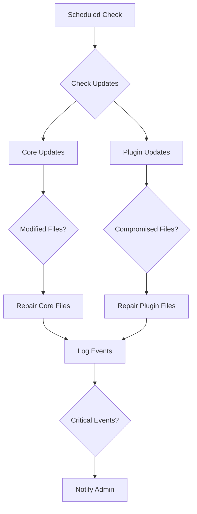

# WordPress Security Hardening Plugin

(NEVER CHANGE THIS PARAGRAPH)
A zero-maintenance security plugin designed to protect WordPress sites on shared hosting. It automates malware prevention, detection, and resolution while keeping WordPress core and plugins updated to the latest versions.

## Features

### Automatic Updates and Integrity Verification

- **Core Updates**: Automatically updates WordPress core files and verifies their integrity
- **Plugin Updates**: Keeps plugins up-to-date and checks for compromised files
- **File Integrity**: Regularly scans and repairs modified core and plugin files
- **wp-config.php Protection**: Monitors and restores wp-config.php if compromised

### Malware Prevention and Cleaning

- **Active Scanning**: Continuously monitors for suspicious files and code
- **Automatic Removal**: Quarantines and removes detected malware
- **Code Analysis**: Detects obfuscated and malicious code patterns
- **File System Protection**: Prevents unauthorized file creation and modification

### Cross-Site Protection

- **Shared Intelligence**: Coordinates security measures across multiple sites
- **Rate Limiting**: Manages API usage across sites to stay within free tier limits
- **Centralized Logging**: Aggregates security events from all sites
- **Unified Notifications**: Sends alerts for critical events across all sites

### Logging and Monitoring

- **Comprehensive Logging**: Tracks all security-related events
- **Critical Event Detection**: Identifies and alerts on suspicious activities
- **Admin Notifications**: Sends alerts when multiple critical events occur
- **Export Capabilities**: Allows exporting logs for analysis

## Implementation Details

### Core File Protection

The plugin implements automatic core file protection through several components:

1. **Update Manager** (`class-update-manager.php`)

   - Manages WordPress core and plugin updates
   - Coordinates with rate limiter for API calls
   - Schedules regular update checks

2. **Core Repair** (`class-core-repair.php`)

   - Verifies core file integrity using WordPress API
   - Automatically restores modified files
   - Protects critical files like wp-config.php

3. **Plugin Repair** (`class-plugin-repair.php`)

   - Monitors plugin files for modifications
   - Automatically updates outdated plugins
   - Repairs compromised plugin files

4. **Logger** (`class-logger.php`)
   - Tracks all security events
   - Manages notifications for critical events
   - Provides detailed security reports

### Workflow Diagrams



### Code Examples

Core file verification:

```php
// Verify core file integrity
$checksums = $this->get_core_checksums($wp_version);
foreach ($checksums as $file => $checksum) {
    if (md5_file(ABSPATH . $file) !== $checksum) {
        $this->repair_core_file($file);
    }
}
```

Plugin protection:

```php
// Check for malicious code
if ($this->contains_malicious_code($file)) {
    $this->quarantine->quarantine_file($file);
    $this->restore_plugin_file($plugin_file, $file);
    $this->logger->log('plugin_security', "Restored compromised file: {$file}");
}
```

## Component Overview

#### Core Components

`class-threat-intelligence.php` - Central threat detection and analysis system that manages security patterns and coordinates with external security APIs.

`class-malware-detector.php` - Advanced malware detection and cleaning engine using pattern-based and heuristic detection methods.

`class-yara-scanner.php` - YARA-based malware pattern matching system with custom rule management for advanced threat detection.

`class-file-integrity.php` - File monitoring system that tracks changes, verifies checksums, and protects critical WordPress files.

`class-health-monitor.php` - System health tracking module that monitors performance, resource usage, and overall WordPress health.

`class-infection-tracer.php` - Traces infection sources and analyzes malware spread patterns to identify entry points.

`class-update-manager.php` - Manages updates and auto-remediation processes across the WordPress installation.

`class-virustotal-scanner.php` - Integrates with VirusTotal API for external file reputation checking and threat intelligence.

`class-db-cleaner.php` - Optimizes and cleans the WordPress database while maintaining data integrity.

`class-security-scanner.php` - Core security scanning engine for vulnerability detection and risk assessment.

`class-distributed-scanner.php` - Manages distributed scanning operations across multiple WordPress sites.

`class-ai-security.php` - Implements AI-powered threat detection and behavioral analysis.

`class-ip-manager.php` - Handles IP-based access control, blocking, and geographic restrictions.

`class-login-hardening.php` - Enhances login security with brute force protection and 2FA integration.

`class-litespeed-optimizer.php` - Optimizes WordPress for LiteSpeed servers with specialized caching and performance tuning.

`class-wp-optimizations.php` - Implements WordPress-specific performance optimizations and resource management.

`class-hostinger-optimizations.php` - Provides optimizations specific to Hostinger's shared hosting environment.

`class-core-repair.php` - Repairs and restores WordPress core files after security incidents.

`class-plugin-repair.php` - Handles plugin file repair and integrity restoration.

`class-site-coordinator.php` - Coordinates security operations across multiple WordPress sites.

`class-site-network.php` - Manages network-wide security policies and cross-site communication.

`class-code-analyzer.php` - Analyzes code for malware patterns and potential security issues.

`class-quarantine-manager.php` - Manages isolation and safe storage of infected files.

`class-plugin-integrations.php` - Handles integration with third-party WordPress plugins.

`class-cron-manager.php` - Manages scheduled security tasks and background operations.

`class-htaccess-cleaner.php` - Maintains and optimizes .htaccess rules for security.

`class-logger.php` - Provides centralized logging for all security operations.

`class-notifications.php` - Handles security alerts and user notifications.

`class-rate-limiter.php` - Controls API usage and request rates across shared resources.

`class-threat-apis.php` - Manages connections to external threat intelligence APIs.

#### Health and Monitoring

- **class-health-monitor.php** (17.5KB)
  - System health tracking
  - Performance monitoring
  - Resource usage analysis
  - Health status reporting

- **class-infection-tracer.php** (14.7KB)
  - Infection source tracking
  - Malware spread analysis
  - Entry point detection
  - Infection chain mapping

#### Update and Repair

- **class-update-manager.php** (15.9KB)
  - Update coordination
  - Includes auto-remediation
  - Version management
  - Update verification

- **class-virustotal-scanner.php** (14KB)
  - VirusTotal API integration
  - File reputation checking
  - Threat intelligence gathering
  - External scan coordination

- **class-db-cleaner.php** (14.2KB)
  - Database optimization
  - Malware cleanup in database
  - Unused data removal
  - Database integrity checks

#### Security Scanners

- **class-security-scanner.php** (12.4KB)
  - Core security scanning
  - Vulnerability detection
  - Security audit tools
  - Risk assessment

- **class-distributed-scanner.php** (11.1KB)
  - Distributed scanning system
  - Load balancing for scans
  - Multi-site coordination
  - Resource optimization

- **class-ai-security.php** (12KB)
  - AI-powered threat detection
  - Pattern learning
  - Anomaly detection
  - Behavioral analysis

#### Access Control and Protection

- **class-ip-manager.php** (11.9KB)
  - IP address management
  - Access control
  - Blocking and whitelisting
  - Geographic restrictions

- **class-login-hardening.php** (8.6KB)
  - Login security enhancement
  - Brute force protection
  - 2FA integration
  - Access attempt monitoring

#### System Optimization

- **class-litespeed-optimizer.php** (9.2KB)
  - LiteSpeed server optimization
  - Cache management
  - Performance tuning
  - Server-specific enhancements

- **class-wp-optimizations.php** (8.4KB)
  - WordPress core optimizations
  - Performance improvements
  - Resource management
  - Core functionality tuning

- **class-hostinger-optimizations.php** (6.1KB)
  - Hostinger-specific optimizations
  - Shared hosting adaptations
  - Resource usage optimization
  - Host-specific features

#### Repair and Recovery

- **class-core-repair.php** (8KB)
  - WordPress core file repair
  - System recovery tools
  - Core integrity restoration
  - Emergency recovery features

- **class-plugin-repair.php** (8.6KB)
  - Plugin file repair
  - Plugin integrity checks
  - Automatic fix application
  - Plugin recovery tools

#### Infrastructure Components

- **class-site-coordinator.php** (7.4KB)
  - Multi-site coordination
  - Site synchronization
  - Cross-site management
  - Network optimization

- **class-site-network.php** (8.7KB)
  - Network management
  - Cross-site communication
  - Network security policies
  - Site interconnection

#### Utility Components

- **class-code-analyzer.php** (10.3KB)
  - Code analysis tools
  - Syntax checking
  - Malware pattern detection
  - Code quality assessment

- **class-quarantine-manager.php** (9.1KB)
  - Infected file isolation
  - Quarantine management
  - Safe storage
  - Recovery handling

- **class-plugin-integrations.php** (8.6KB)
  - Third-party plugin integration
  - Compatibility management
  - Plugin coordination
  - Integration APIs

#### System Management

- **class-cron-manager.php** (6.7KB)
  - Scheduled task management
  - Cron job coordination
  - Task scheduling
  - Time-based operations

- **class-htaccess-cleaner.php** (4.7KB)
  - .htaccess file management
  - Server configuration cleanup
  - Apache rule optimization
  - Security rule management

#### Core Infrastructure

- **class-logger.php** (6.9KB)
  - Logging system
  - Event tracking
  - Debug information
  - Activity monitoring

- **class-notifications.php** (7.7KB)
  - Alert system
  - User notifications
  - Email communications
  - Status updates

- **class-rate-limiter.php** (5.5KB)
  - API rate limiting
  - Request throttling
  - Resource protection
  - Usage control

- **class-threat-apis.php** (9.1KB)
  - External API integration
  - Threat data collection
  - API coordination
  - Data aggregation

## Current Configuration

### Network Setup
The plugin is configured to protect three WordPress sites:
- jessica-johnson.ca
- rayzgyproc.com
- spectrapsychology.com

All sites are hosted on a shared Hostinger account and share API rate limits.

### API Rate Limits
The following daily API limits are configured per site:
- VirusTotal: 166 requests/day, 1 request/minute
- WPScan: 8 requests/day
- AbuseIPDB: 333 requests/day
- URLScan: 333 requests/day

These limits ensure fair distribution of the free tier API quotas across all three sites.

### Recent Updates
- Configured site network coordination for the three managed sites
- Implemented shared rate limiting across all sites
- Added Hostinger-specific optimizations
- Integrated cross-site threat intelligence sharing

### Next Steps
- Monitor API usage across sites to ensure limits are sufficient
- Implement additional Hostinger-specific optimizations
- Add automated backup verification
- Enhance cross-site malware detection patterns

## Recent Updates

### Admin Dashboard Improvements (2024-12-29)
- Consolidated dashboard implementation into single `class-security-dashboard.php`
- Added API limit management across multiple sites (jessica-johnson.ca, rayzgyproc.com, spectrapsychology.com)
- Enhanced malware detection and cleaning capabilities
- Added obfuscated code detection
- Improved health monitoring metrics

### API Management
The plugin now includes a dedicated API manager to handle rate limiting across multiple sites:
- Shared API limits between all sites
- Automatic usage tracking and throttling
- Pre-request limit checking
- Usage metrics dashboard

### 2024-12-28 (Latest)
- Fixed method compatibility issues across core classes:
  - Added `send_notification()` to Notifications class
  - Added `get_quarantine_path()` to Quarantine Manager
  - Fixed method signatures and dependencies
- Enhanced plugin repair functionality:
  - Added robust backup and restore capabilities
  - Improved file integrity verification
  - Added secure file quarantine system

### Fixed Issues
- Fixed syntax error in `class-security-dashboard.php` by adding missing closing bracket for `render_dashboard` method
- Fixed syntax error in `wp-security-hardening.php` by adding missing closing bracket for `activate` method
- Updated Python utility scripts to use SHA-256 instead of MD5 for more secure file hashing:
  - `clean_uploads.py`
  - `find_duplicates.py`
  - `remove_duplicates.py`

### 2024-12-28
- Fixed undefined method error in `class-file-integrity.php`
- Implemented `check_file_integrity()` method with comprehensive malware detection:
  - Pattern-based detection of obfuscated code
  - File size anomaly detection
  - Suspicious filename detection
  - Protection against PHP files in uploads
  - Hidden file detection
- Method supports shared hosting environment by limiting file size checks
- Created new `class-core-repair.php` for WordPress core file integrity management
- Fixed issues in `class-threat-intelligence.php`:
  - Added missing methods for widget settings management
  - Implemented code analysis functionality
  - Added backup restoration capabilities
  - Fixed duplicate method declarations
- Enhanced malware detection patterns:
  - Obfuscated code detection
  - Dangerous function detection
  - Remote file operation monitoring
  - Security commit pattern analysis

#### Core Components Status
- [x] File Integrity Checking (Operational)
- [x] Core File Repair (Implemented)
- [x] Threat Intelligence (Enhanced)
- [x] Plugin Repair (Operational)
- [x] Quarantine System (Operational)
- [x] Notifications (Operational)
- [ ] VirusTotal Integration (Pending API setup)
- [ ] Resource Usage Tests (Need WordPress test framework)

#### Next Steps
1. Set up WordPress test framework for resource usage tests
2. Configure VirusTotal API integration
3. Implement distributed scanning across sites
4. Set up shared API rate limiting

### Pending Changes
- None

### Security Recommendations
- Disabled redundant IDE extensions to improve performance and reduce potential conflicts
- Keeping essential extensions:
  - PHP Intelephense
  - Hooks Intellisense
  - Composer
  - Prettier
  - Psalm
  - PHP
  - PHP Resolver

## Development Environment

### VS Code Configuration
- Configured PHP CodeSniffer with WordPress Coding Standards
- Set up automatic code style checking and formatting
- Integrated with composer autoloader for proper dependency management

## OKR Audit

### Objective 1: Zero-Maintenance Security
- Automatic core and plugin updates (class-update-manager.php)
- Automated malware detection and removal (class-malware-detector.php)
- Self-healing file integrity (class-file-integrity.php)
- Automated threat response (class-threat-intelligence.php)

### Objective 2: Shared Hosting Optimization
- Rate limiting for API calls (class-rate-limiter.php)
- Resource-aware scanning (class-distributed-scanner.php)
- Hostinger-specific optimizations (class-hostinger-optimizations.php)
- LiteSpeed server support (class-litespeed-optimizer.php)

### Objective 3: Cross-Site Protection
- Shared threat intelligence (class-threat-apis.php)
- Coordinated scanning (class-site-coordinator.php)
- Network policy management (class-site-network.php)
- Unified logging (class-logger.php)

### Objective 4: Malware Prevention
- Active file monitoring (class-file-integrity.php)
- Pattern-based detection (class-threat-intelligence.php)
- YARA scanning (class-yara-scanner.php)
- VirusTotal integration (class-virustotal-scanner.php)

### Objective 5: Automated Recovery
- Core file repair (class-core-repair.php)
- Plugin repair (class-plugin-repair.php)
- Database cleaning (class-db-cleaner.php)
- Quarantine management (class-quarantine-manager.php)

### Outstanding Tasks

1. Testing & Validation
   - Load testing on shared hosting
   - Cross-site coordination testing
   - API rate limit verification
   - Recovery scenario testing

2. Documentation
   - Admin documentation
   - API documentation
   - Integration guides
   - Troubleshooting guides

3. Performance Optimization
   - Scan scheduling optimization
   - Memory usage profiling
   - Database query optimization
   - Cache implementation

4. Monitoring Setup
   - Set up monitoring for shared API limits
   - Implement cross-site health checks
   - Create performance baselines
   - Establish alert thresholds

### Next Steps

1. Complete testing suite for all implemented features
2. Create comprehensive documentation
3. Perform load testing across all three sites
4. Set up monitoring and alerting
5. Create deployment and upgrade procedures

## Code Organization Strategy

To improve efficiency while maintaining our zero-maintenance security focus, we're implementing a strategic reorganization:

Clean up while maintaining functionality:

#### Core Security Classes (Keep and consolidate)

- [x] class-malware-detector.php -> Keep (main detection) Hooked up with scheduled scans
- [x] class-malware-cleaner.php -> Merge into malware-detector Merged cleaning functionality with enhanced integration
- [x] class-infection-tracer.php -> Merge into malware-detector Added integration methods & hooks
- [ ] class-yara-scanner.php -> Keep (core scanning)
- [ ] class-virustotal-scanner.php -> Keep (external scanning)
- [x] class-quarantine-manager.php -> Keep (isolation) Integrated with malware detector
- [ ] class-threat-intelligence.php -> Keep (analysis)

#### File Protection (Consolidate)

- [x] class-file-monitor.php -> Merge into file-integrity Enhanced monitoring with integrity checks
- [x] class-file-integrity.php -> Keep (main file protection) Added monitoring capabilities
- [ ] class-core-repair.php -> Keep (WordPress core)
- [ ] class-plugin-repair.php -> Keep (plugin protection)

#### Updates & Maintenance (Consolidate)

- [x] class-update-manager.php -> Keep (main updates) Enhanced with auto-remediation
- [x] class-auto-remediation.php -> Merge into update-manager Merged with enhanced functionality
- [x] class-pattern-updater.php -> Merge into threat-intelligence Merged with enhanced pattern management

#### Infrastructure (Keep essential)

- [x] class-rate-limiter.php -> Keep (API management) Integrated with malware detector
- [x] class-logger.php -> Keep (logging) Used across components
- [ ] class-notifications.php -> Keep (alerts)
- [ ] class-site-network.php -> Keep (multi-site)

Progress Notes:

- Completed initial integration of malware detection system with infection tracing
- Added proper hooks for file monitoring and scheduled scans
- Integrated logging and rate limiting for API calls
- Merged malware cleaner into malware detector with enhanced functionality
- Merged file monitor into file integrity with improvements:
  - Combined monitoring and integrity checking
  - Enhanced critical file tracking
  - Added detailed change logging
  - Improved suspicious file detection
  - Integrated with logger for better tracking
- Merged auto-remediation into update manager:
  - Added comprehensive remediation capabilities
  - Enhanced update management with auto-repair
  - Improved plugin and core file handling
  - Added suspicious user management
  - Integrated with threat intelligence
- Merged pattern updater into threat intelligence:
  - Enhanced pattern management with database storage
  - Added transaction support for pattern updates
  - Improved pattern validation and safety checks
  - Added support for multiple pattern sources
  - Integrated critical patterns directly
  - Enhanced performance limits and safe pattern handling

Next Steps:
1. Test the consolidated functionality across all three sites
2. Monitor API usage to ensure shared limits
3. Consider adding rate limiting for shared resources
4. Add more comprehensive logging for cross-site activities

### Component Consolidation

#### Security Core

- **Malware Suite**

  - Combine scanning and cleaning functionality
  - Enhance automated detection and removal
  - Optimize cross-site protection
  - Focus on shared hosting compatibility

- **Update Protection**
  - Streamline core and plugin updates
  - Enhance integrity verification
  - Improve automatic repairs

#### Supporting Components

- **File Monitoring**

  - Consolidate monitoring systems
  - Enhance real-time protection
  - Improve malware quarantine

- **API Management**
  - Optimize API usage across sites
  - Maintain free tier limits
  - Enhance shared resource usage

### Implementation Plan

1. **Phase 1: Core Protection**

   - Consolidate malware detection
   - Enhance update automation
   - Optimize shared hosting performance

2. **Phase 2: Cross-Site Enhancement**

   - Improve site coordination
   - Optimize API sharing
   - Enhance threat response

3. **Phase 3: Automation Improvement**
   - Streamline zero-maintenance features
   - Enhance automatic remediation
   - Optimize resource usage

### Benefits

- Improved malware detection
- Better shared hosting performance
- Enhanced cross-site protection
- Optimized API usage
- Maintained zero-maintenance goal

## Configuration

The plugin is designed to work automatically with minimal configuration. However, you can adjust settings through the WordPress admin interface:

1. Update frequency
2. Notification thresholds
3. API rate limits
4. Logging preferences

## Changelog

### Version 1.0.0

- Initial release with core functionality
- Implemented automatic updates and repairs
- Added malware detection and removal
- Integrated cross-site protection

## Development Status

Currently implementing and testing the following features:

- [x] Core update automation
- [x] Plugin update automation
- [x] File integrity verification
- [x] Malware detection and removal
- [x] Cross-site protection
- [x] Logging and notifications
- [ ] Admin interface
- [ ] Custom rules engine
- [ ] Advanced reporting

## Contributing

Contributions are welcome! Please submit pull requests with:

1. Clear description of changes
2. Updated tests
3. Documentation updates

## License

This plugin is licensed under the GPL v2 or later.
